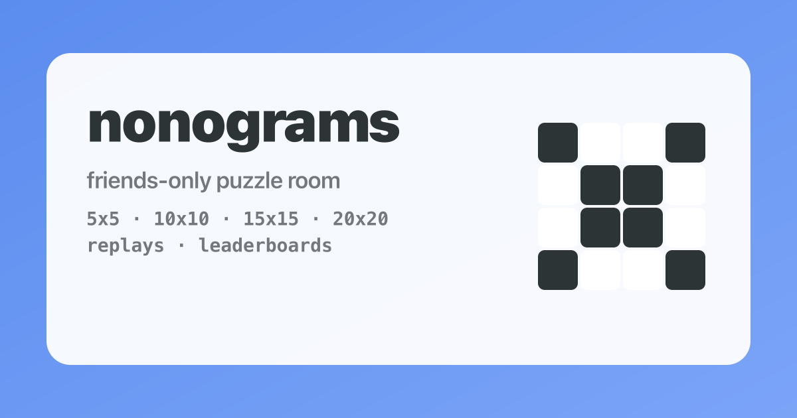

# nonogram

Friends-only nonogram web app on Cloudflare Pages + D1.



## Features

- **5x5, 10x10, 15x15, and 20x20 puzzles** — procedurally generated with a seeded Markov chain
- **Live leaderboards** — SSE-powered real-time updates, filterable by day/week/month/all-time
- **KDE activity plots** — mini kernel density estimation visualizations on leaderboard entries and game history
- **Replay system** — watch any completed solve move-by-move with inline transport controls, scrubber, and KDE overlay
- **Shareable links** — share replays with OG embed previews
- **My Games** — browse game history, continue in-progress games, replay completed ones, or play again
- **Fair leaderboard eligibility** — only first attempts count; viewing replays or re-attempting a puzzle disqualifies you
- **Offline mode** — play locally-generated puzzles without an account
- **Invite-only registration** — admin-managed invite codes with usage limits and expiry
- **Dark mode** — theme toggle with persistence
- **Mobile-friendly** — touch support with drag painting, responsive grid sizing
- **Admin dashboard** — user stats, in-progress games, recent activity, invite management, stale attempt cleanup

## Local dev

Prereqs: `node`, `npm`, `wrangler` (installed via `npm i` in this repo).

1. Install deps:
```sh
npm install
```

2. Configure local vars (optional):
- Copy `.env.example` values into `.dev.vars` (this file is gitignored).
- If you want captcha locally, set `VITE_TURNSTILE_SITE_KEY` in `.env` too (Vite reads `.env*`).

3. Create a local D1 db and run migrations:
```sh
npx wrangler d1 create nonogram-db
# copy the database_id into wrangler.toml
npx wrangler d1 migrations apply DB --local
```

4. Run dev server:
```sh
npm run dev
```

In another terminal, run Pages Functions locally against the built output:
```sh
npm run build
npm run pages:dev
```

## Local dev (Docker)

1. Put local vars in `.dev.vars` (gitignored). If you want captcha locally, include:
- `VITE_TURNSTILE_SITE_KEY`
- `TURNSTILE_SECRET_KEY`

2. Start:
```sh
docker compose up --build
```

3. Initialize local D1 schema (persists in `./.wrangler`):
```sh
docker compose run --rm web npx wrangler d1 migrations apply DB --local
```

## Deploy (Cloudflare Pages)

1. Create a D1 database and apply migrations:
```sh
npx wrangler d1 create nonogram-db
npx wrangler d1 migrations apply DB
```

2. In Cloudflare Pages:
- Set D1 binding `DB` to the database.
- Add env vars:
  - `TURNSTILE_SECRET_KEY` (required if you set `VITE_TURNSTILE_SITE_KEY`)
  - `VITE_TURNSTILE_SITE_KEY` (optional; build-time)
  - `BOOTSTRAP_TOKEN` (secret; used once to make your account admin so you can manage invite codes)
  - `INVITES_REQUIRED` (optional; default is invite-only. Set to `0` to allow open registration.)

3. Deploy:
```sh
npm run build
npm run pages:deploy
```

## Invite Codes (Friends-Only Signup)

By default, registration requires an invite code.

1. Set `BOOTSTRAP_TOKEN` in Pages env vars (a random string).
2. Deploy.
3. Create your account via the Register page (you will need an invite code; see note below).
4. Promote yourself to admin:

```sh
curl -sS -X POST 'https://<your-domain>/api/admin/bootstrap' \
  -H 'content-type: application/json' \
  -b 'sid=<your session cookie>' \
  --data '{"token":"<BOOTSTRAP_TOKEN>"}'
```

Then create invite codes (admin only):

```sh
# create (returns plaintext code once)
curl -sS -X POST 'https://<your-domain>/api/admin/invites' \
  -H 'content-type: application/json' \
  -b 'sid=<your session cookie>' \
  --data '{"maxUses":5,"expiresInDays":30}'

# list
curl -sS 'https://<your-domain>/api/admin/invites' -b 'sid=<your session cookie>'

# disable (revoke)
curl -sS -X PUT 'https://<your-domain>/api/admin/invites' \
  -H 'content-type: application/json' \
  -b 'sid=<your session cookie>' \
  --data '{"id":"<invite id>"}'
```

Note: On a brand-new database with `INVITES_REQUIRED` enabled, you'll need to create the first invite directly in D1 or temporarily set `INVITES_REQUIRED=0` to create your admin account, then set it back.
